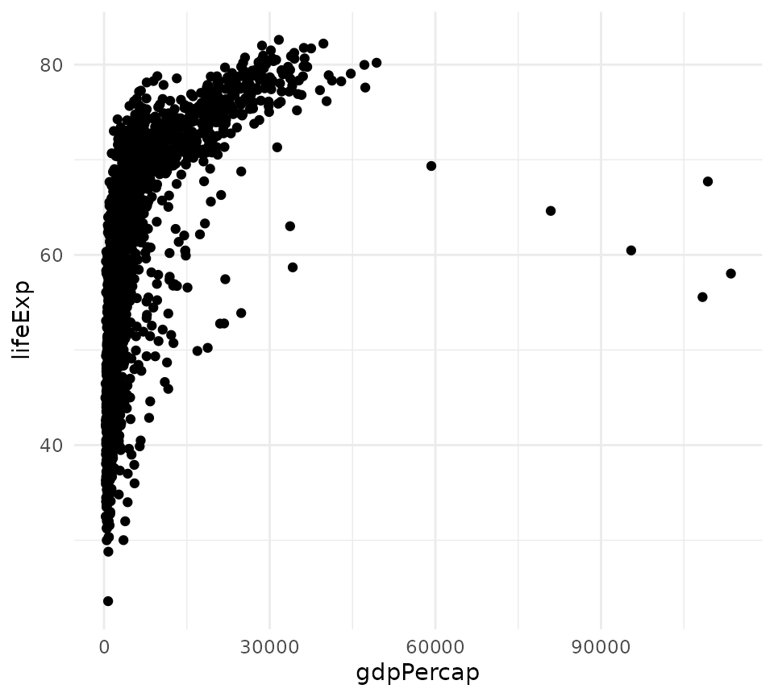

# Benchmark

## Introduction

The vignette benchmarks `c3plot` against various other plotting systems
for R, namely `plotly`. Two basic plots will be used for this benchmark,
a basic scatter plot and a grouped line plot. I am uncertain if
JavaScript execution time is counted by `microbenchmark`. Even if we
assume it isn’t, the benchmark results are informative because it’s
always better if the R process gets tied up for less time per plot.
First, let’s load the visualization packages to compare:

``` r
library(c3plot)
library(c3)
#> 
#> Attaching package: 'c3'
#> The following objects are masked from 'package:graphics':
#> 
#>     grid, legend
library(plotly)
#> Loading required package: ggplot2
#> 
#> Attaching package: 'plotly'
#> The following object is masked from 'package:ggplot2':
#> 
#>     last_plot
#> The following object is masked from 'package:stats':
#> 
#>     filter
#> The following object is masked from 'package:graphics':
#> 
#>     layout
library(ggplot2)
```

## Scatter Plot

First, we will benchmark the creation of simple scatter plots using data
from the `gapminder` package. To begin, we will define functions to
create similar scatterplots using each of the packages to be compared.
The plots themselves are not important but are shown to demonstrate that
they work and produce roughly similar plots.

``` r
library(gapminder)

gapminder <- gapminder

plot_base <- function(x){
  
  plot(x = x$gdpPercap, y = x$lifeExp)
}

plot_base(gapminder)
```


``` r
plot_c3plot <- function(x){
 
  c3plot(x = x$gdpPercap, y = x$lifeExp, sci.x = TRUE)
}
plot_c3plot(gapminder)
```

``` r
plot_plotly <- function(x){
  plot_ly(data = x, x = ~gdpPercap, y = ~lifeExp, type = "scatter")
}
plot_plotly(gapminder)
#> No scatter mode specifed:
#>   Setting the mode to markers
#>   Read more about this attribute -> https://plotly.com/r/reference/#scatter-mode
```

``` r
plot_ggplotly <- function(x){
  g <- ggplot(x, aes(x = gdpPercap, y = lifeExp)) + geom_point() + theme_minimal()
  ggplotly(g)
}
plot_ggplotly(gapminder)
```

``` r
plot_ggplot <- function(x){
  ggplot(x, aes(x = gdpPercap, y = lifeExp)) + geom_point() + theme_minimal()
}
plot_ggplot(gapminder)
```



``` r
plot_c3 <- function(x){
 c3(x, x = "gdpPercap", y = "lifeExp") %>%
    c3_scatter()
}
plot_c3(gapminder)
```

Now, these functions are benchmarked:

``` r
library(microbenchmark)
m <- microbenchmark(base = plot_base(gapminder),
               c3plot = plot_c3plot(gapminder),
               plotly = plot_plotly(gapminder),
               ggplotly = plot_ggplotly(gapminder),
               ggplot = plot_ggplot(gapminder),
              c3 = plot_c3(gapminder),
               unit = "ms",
               times = 50)
```

``` r
m
#> Unit: milliseconds
#>      expr        min         lq        mean     median         uq        max
#>      base  24.112747  61.135876  60.6216804  61.296631  61.537867  62.382674
#>    c3plot   0.072004   0.108012   0.1543805   0.125419   0.138729   1.786223
#>    plotly   0.355313   0.456582   0.6453144   0.562665   0.615899   4.345759
#>  ggplotly 165.813627 176.274739 183.0986376 181.453437 185.506453 305.221531
#>    ggplot  33.327023  35.751679  38.7725242  38.214823  41.858583  46.683476
#>        c3   1.550744   2.037963   3.0287584   2.258289   2.369451  36.770358
#>  neval
#>     50
#>     50
#>     50
#>     50
#>     50
#>     50
```

On my main development machine, c3plot was the quickest by an order of
magnitude. This can vary, but `plotly` is roughly 20 times slower, and
[`ggplotly()`](https://rdrr.io/pkg/plotly/man/ggplotly.html) is hundreds
of times slower. However, `plotly` was still quick enough that the
performance difference with `c3plot` would be imperceptible to users.

``` r
plot(m)
```


Let’s look at kernel density plots of the time distributions for
`c3plot` and `plotly`.

``` r
density_c3plot <- density(m$time[m$expr == "c3plot"])
c3plot(density_c3plot)
```

``` r
density_plotly <- density(m$time[m$expr == "plotly"])
c3plot(density_plotly)
```

Let’s use a two-sample Wilcoxon test to compare the means of execution
time for c3plot and plotly. A t-test would not be suitable because we
cannot assume normality. The null hypothesis is that `c3plot` and
`plotly` will have the same mean execution time for these scatter plots.

``` r
w <- wilcox.test(m$time[m$expr == "c3plot"],
                 m$time[m$expr == "plotly"],
                 alternative = "less",
                 paired = FALSE)
w
#> 
#>  Wilcoxon rank sum test with continuity correction
#> 
#> data:  m$time[m$expr == "c3plot"] and m$time[m$expr == "plotly"]
#> W = 48, p-value < 2.2e-16
#> alternative hypothesis: true location shift is less than 0
```

Can we reject the null hypothesis?

``` r
ifelse(w$p.value < .05, "yes", "no")
#> [1] "yes"
```

## Grouped Line plots

Making line plots colored by group is a common plotting task that could
potentially expose some slowness in `c3plot`. We will make line plots of
the total GDP by continent by year. First, we must summarize the data
and define functions for making this lineplot with various packages.

``` r
library(dplyr)
#> 
#> Attaching package: 'dplyr'
#> The following objects are masked from 'package:stats':
#> 
#>     filter, lag
#> The following objects are masked from 'package:base':
#> 
#>     intersect, setdiff, setequal, union
gdp_cont <- gapminder %>%
  mutate(gdp = pop * gdpPercap) %>%
  group_by(continent, year) %>%
  summarize(total_gdp = sum(gdp))
#> `summarise()` has regrouped the output.
#> ℹ Summaries were computed grouped by continent and year.
#> ℹ Output is grouped by continent.
#> ℹ Use `summarise(.groups = "drop_last")` to silence this message.
#> ℹ Use `summarise(.by = c(continent, year))` for per-operation grouping
#>   (`?dplyr::dplyr_by`) instead.

plot_title <- "Total GDP by Continent 1952 - 2007"
```

``` r
c3plot_line <- function(x){
  c3plot(x$year, x$total_gdp, col.group = x$continent, sci.y = TRUE, 
         type = "l", main = plot_title, xlab = "Year", ylab = "GDP",
         legend.title = "Continent")
}

c3plot_line(gdp_cont)
```

``` r
ggplot_line <- function(x){
  ggplot(x, aes(x = year, y = total_gdp, col = continent, group = continent)) +
    geom_line() +
    theme_minimal() +
    labs(title = plot_title, x = "Year", y = "GDP")
}
ggplot_line(gdp_cont)
```


``` r
ggplotly_line <- function(x){
  p <- ggplot(x, aes(x = year, y = total_gdp, col = continent)) +
    geom_line() +
    theme_minimal() +
    labs(title = plot_title, x = "Year", y = "GDP")
  ggplotly(p)
}

ggplotly_line(gdp_cont)
```

``` r
plotly_line <- function(x){
  plot_ly(data = x, x = ~year, y = ~total_gdp, split = ~continent,
          type = "scatter", color  = ~continent, mode = "lines")
}
plotly_line(gdp_cont)
```

Now let’s benchmark these line plot functions:

``` r
m2 <- microbenchmark(c3plot = c3plot_line(gdp_cont),
                     ggplotly = ggplotly_line(gdp_cont),
                     plotly = plotly_line(gdp_cont),
                     ggplot = ggplot_line(gdp_cont),
                     unit = "ms",
                     times = 50)
```

``` r
m2
#> Unit: milliseconds
#>      expr        min         lq        mean      median         uq        max
#>    c3plot   0.427568   0.487099   0.5982529   0.5664315   0.617352   2.559056
#>  ggplotly 172.980832 175.293277 180.2836893 179.9565140 182.489315 206.759426
#>    plotly   0.374259   0.416668   0.5288740   0.4701820   0.589110   2.242484
#>    ggplot  35.050278  36.059972  40.8158523  37.1442505  39.399484 180.196858
#>  neval
#>     50
#>     50
#>     50
#>     50
```

``` r
plot(m2)
```


Let’s perform the same test as before:

``` r
w2 <- wilcox.test(m2$time[m2$expr == "c3plot"],
                 m2$time[m2$expr == "plotly"],
                 alternative = "less",
                 paired = FALSE)
w2
#> 
#>  Wilcoxon rank sum test with continuity correction
#> 
#> data:  m2$time[m2$expr == "c3plot"] and m2$time[m2$expr == "plotly"]
#> W = 1765, p-value = 0.9998
#> alternative hypothesis: true location shift is less than 0
```

Can we reject the null hypothesis that c3 and plotly have the same mean?

``` r
ifelse(w2$p.value < .05, "yes", "no")
#> [1] "no"
```

## Conclusions

Although benchmark results will vary on different systems, the results
on my development machine indicate that c3plot is faster than plotly
(and others) for both the scatter plot and grouped line plot tested.
Although statistically significant, the difference in performance
between c3plot and plotly would almost certainly never be perceptible to
users.

Both c3plot and direct use of plotly potentially offer perceptible
performance improvements over using
[`ggplotly()`](https://rdrr.io/pkg/plotly/man/ggplotly.html) to generate
interactive visualizations. Shiny developers may find this information
useful.
